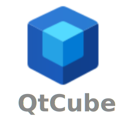
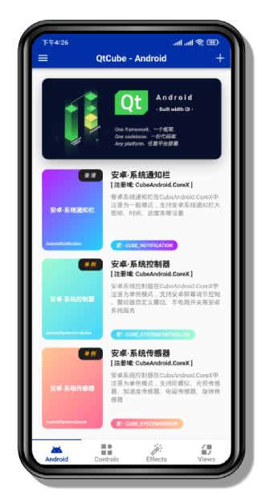

<p align="center">
    <br/>
    为Qt For Android开发者与设计师提供快捷灵活的工具组件与UI控件 
</p>
<p align="center">
    &emsp;
    <br/>
    QtCube使用Qt6构建，推荐的QT版本：Qt Version > Qt 6.2.0
</p>
&emsp;

# **安卓APP演示界面**
## *多个主题、多种组件、多类工具*
<p align="center">
    
    
</p>


# **如何使用**
##  ***使用QMake进行构建-[CubeAndroid]***
-   ### **<导入模块>**

1. 添加'include(../QtCube/CubeAndroid.pri)'到您的 .pro 文件
```qmake
include(../QtVista/CubeAndroid.pri)
```
2. 在您的main.cpp中导入<CubeAndroid/CubeAndroidManager.h>头文件
```cpp
#include <CubeAndroid/CubeAndroidManager.h>
```
3. 在您的main.cpp中使用QtCube的注册函数以便在QML中使用它们
```cpp
...
QQmlApplicationEngine engine;
engine.addImportPath(QStringLiteral("qrc:/"));
initializeCubeAndroid(); //注册函数必须在QQmlApplicationEngine实例化后使用
......
```
4. 到这里恭喜您，您可以开始使用第一个代码实例了(以下是QML部分代码展示)
```qml
import QtQuick
import QtQuick.Controls
import CubeAndroid.CoreX

Page{
    AndroidNotification{
        id: notification
        channelName: "Notification"
        contentTitle: "QtCube"
        contentText: "Hello, QtCube! ❤️❤️❤️"
        smallIconR: "icon"
        Component.onDestruction: notification.deleteChannel()
    }
    Button{
        text: "StartNotify"
        onClicked: notification.startNotify()
    }
}
```
-   ### **<简要说明>**

CubeAndroid使用JNI开发并进行了QML注册, 您可以在QML中使用简单的Android工具进行开发

 简介表单
------------------

| QML                      | Import           | DEFINES              | 功能特性         | 
|:-------------------------|:-----------------|:---------------------|:-----------------|
|AndroidNotification       |CubeAndroid.CoreX |CUBE_NOTIFICATION     |安卓系统通知栏    |
|AndroidSystemController   |CubeAndroid.CoreX |CUBE_SYSTEMCONTROLLER |安卓系统控制器    |
|AndroidSystemSensor       |CubeAndroid.CoreX |CUBE_SYSTEMSENSOR     |安卓系统传感器    |
                                                                   
##  ***使用QMake进行构建-[CubeQuick]***
-   ### **<导入模块>**

1. 添加'include(../QtCube/CubeQuick.pri)'到您的 .pro 文件
```qmake
include(../QtVista/CubeQuick.pri)
```
2. CubeQuick中的组件开箱即用, 您可以开始使用第一个代码实例了(以下是QML部分代码展示)
```qml
import QtQuick
import QtQuick.Controls
import CubeQuick.Controls

Page{
    CubeGlowRectangle{
        id: glowRectangle
        anchors.centerIn: parent
        width: 258
        height: 258
        radius: 8
        glowRadius: 8
        color: "#FAFAFA"
        glowColor: "#41CD52"
    }
}
```

-   ### **<简要说明>**

CubeQuick采用纯QML代码开发并且无任何第三方依赖,它包含了一系列快捷方便的UI组件供您设计\
因此这个模块也适用于其他平台的设计开发

 简介表单
------------------

| Import                              | 功能特性                        |       
|:------------------------------------|:--------------------------------|
|CubeQuick.Controls                   |一些基本的组件和功能性小部件     |
|CubeQuick.Controls.Dialog            |用户交互的对话框和功能性窗口     |
|CubeQuick.Controls.LoadingIndicator  |进行耗时操作时的指示器           |
|CubeQuick.Controls.ProgressBar       |显示任务进度的功能组件           |
|CubeQuick.Effects                    |一些作用于UI组件的基本动画效果   |
|CubeQuick.Effects.MediaEffect        |基于媒体播放器的效果             |
|CubeQuick.Views                      |常用型基础的视图                 |
|CubeQuick.Views.PathView             |基于QML-PathView产生的高级视图   |


# **文档说明**
## 就快有了！！！😜😜😜
&emsp;

# **许可证书**

QtCube使用 [LGPLv3 License](LICENSE.md). 您可以根据自由软件基金会发布的 GNU 宽松公共许可证的条款重新分发或修改它.
